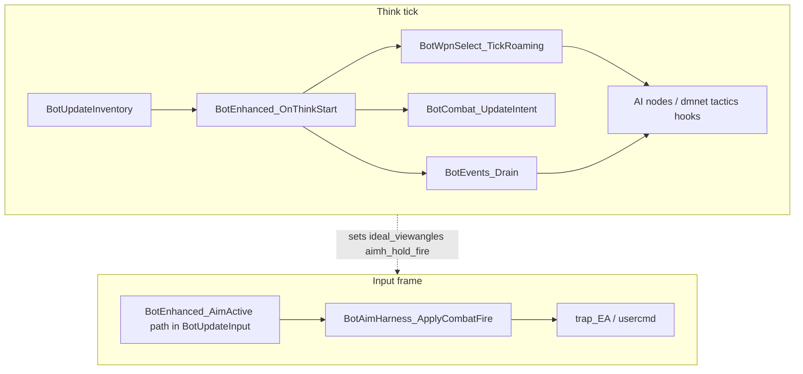

# Bot enhanced AI — architecture & acceptance

Refactor foundation for Devotion bot upgrades (aim harness, smart weapons, tactical AI). Gameplay behavior should match the pre-refactor feature set when the parity table below passes. New stances, move harness logic, and gauntlet fixes are **follow-up work** on this scaffold.

See also: [BOT-CVARS.md](BOT-CVARS.md) (full cvar list and legacy names).

---

## Think vs input

Two layers run on different cadences:

| Layer | When | Entry | Purpose |
|-------|------|--------|---------|
| **Think** | `bot_thinktime` (default 100 ms) | `BotDeathmatchAI` → `BotEnhanced_OnThinkStart` | Decisions: inventory, events, combat intent, weapon roam, AI nodes |
| **Input** | Every client frame | `BotUpdateInput` | Actuation: view motor, `+attack` hold, usercmd to engine |



**North-facing include for hooks:** `ai_bot_enhanced.h` (`BotEnhanced_IsActive`, `BotEnhanced_DebugActive`, `BotEnhanced_OnThinkStart`, register/reset).

---

## Cvar matrix

| Cvar | Role |
|------|------|
| `bot_enhanced` | Master gate (default `0`). When `1`, all enhanced features are on: aim harness, weapons, tactics, items, item timing (FFA/Duel/TDM), movement (RJ + walkoff), position, opponent (1v1), nav guard, combat intent. |
| `bot_enhanced_debug` | Server-side debug logging for enhanced subsystems (item commits, nav guard, opponent inference). Requires `bot_enhanced 1`. |
| `bot_debugAim` | Client cheat debug (independent); see BOT-CVARS.md |

Deprecated `bot_enhanced_*` sub-cvars and legacy `bot_humanizeaim` / `bot_smartWeaponChoice` / `bot_tacticalAI` are read once at init for migration (see BOT-CVARS.md).

---

## File ownership

| File | Role |
|------|------|
| `ai_bot_enhanced.c/h` | Master cvar, `BotEnhanced_IsActive` / `BotEnhanced_DebugActive`, `OnThinkStart`, register/reset orchestration, goal-stack guards |
| `ai_bot_items.c/h` | Visible pickup commits, item timing (merged), botlib item chooser wrappers |
| `ai_bot_combat.c/h` | `bot_combat_intent_t`; stance/move/fire policy |
| `ai_bot_events.h` | Ingress API (`BotEvents_Push`); implementation in `ai_bot_tactics.c` |
| `ai_bot_move_harness.c/h` | Movement-view bypass, RJ maneuver, walk-off avoidance, `BotMove_BuildTravelFlags` / `BotMove_EffectiveTfl`, move util helpers |
| `ai_bot_move_util.h` | Shared geometry/view helper declarations (implemented in harness) |
| `ai_aim_harness.c/h` | Humanized view motor; monotonic menu skill 0–5 accuracy ladder; suppressive fire (wide cone, all skills); rail/RL/SG shot urgency (reload+grace without firing widens track/trace tolerances); rail lead-and-wait + trace/urgency fire |
| `ai_weapon_select.c/h` | Range/ammo weapon picker + roam selection; voluntary close combat (25%: SG > plasma > gauntlet) |
| `ai_bot_tactics.c/h` | Gauntlet flee, hurt-by-other, closer threat (skill + distance-scaled swap chance), finish wounded |
| `ai_main.h` | `combat`, `evt_*`, `aimh_*`, `movej_*`, `wps_*`, `tact_*` blocks |
| `ai_dmq3.c` | `BotDeathmatchAI`, aim-at-enemy, `BotChooseWeapon`, `BotJumppad_Update` (thin `BotJumppad_EffectiveTfl` → harness) |
| `ai_dmnet.c` | Battle/retreat node hooks; calls `BotEnhanced_*` goal-stack helpers before nearby/LTG item choose |
| `ai_main.c` | `BotUpdateInput` aim path |

---

## Extension cookbook

### New combat stance

1. Add enum value in `ai_bot_combat.h` (`bot_stance_t`).
2. Implement logic in `BotCombat_UpdateIntent()` (called every think when `bot_enhanced` is on).
3. Read `bs->combat.stance` / `move_policy` from `BotAttackMove` or weapon nodes as needed.
4. No new cvar required if gated by existing features.

### New move policy

1. Extend `bot_move_policy_t` in `ai_bot_combat.h`.
2. Set policy in `BotCombat_UpdateIntent()`.
3. Implement actuation in `ai_bot_move_harness.c` (reuse `ai_bot_move_util.c` for walk/view/helpers); call `BotMove_OnPostMoveToGoal` after `trap_BotMoveToGoal` and `BotMove_OnInputFrame` from `BotUpdateInput` when `BotMove_SuppressesAimMotor()`.

### Botlib movement + enhanced aim (rocket jump)

When `bot_enhanced_aim` is on, botlib `MOVERESULT_MOVEMENT*` (rocket/BFG jump, swim, activate shoot) must not be overridden by the aim harness motor.

| Hook | Where | Role |
|------|--------|------|
| `BotMove_OnPostMoveToGoal` | `ai_dmnet.c` after each `trap_BotMoveToGoal` | Cache moveresult flags; short latch after movement view |
| `BotMove_SuppressRoamView` | `ai_dmnet.c` roam-view branches | Skip roam ideal angles while botlib owns view |
| `BotMove_SuppressesAimMotor` | `ai_aim_harness.c`, `BotUpdateInput` | Skip harness motor / use legacy input path |
| `BotMove_OnInputFrame` | `BotUpdateInput` | Vanilla view smoothing + `trap_EA_GetInput` while suppressed |

No rocket-jump logic in `ai_dmq3.c`; botlib handles jump/attack timing.

**Enhanced RJ maneuver** (active prep/fire coordination) requires **both** `bot_enhanced_aim` (view-motor bypass) and `bot_enhanced_movement`. With only `bot_enhanced_aim` on, the aim motor still yields to botlib view during native RJ travel but the harness does not actively prepare or fire the jump. The standard `bot_rocketjump` botlib path is unaffected by either cvar.

**Walk-off ledge:** after `trap_BotMoveToGoal`, if `traveltype == TRAVEL_WALKOFFLEDGE` and `bot_enhanced_movement` is on, `trap_AAS_PredictClientMovement` with `SE_HITGROUNDDAMAGE` estimates fall damage; if damage ≥ half current health, the reach is avoided (`TFL_WALKOFFLEDGE` stripped, `BotResetAvoidReach`) and `BotItems_RequestUrgentHealth` commits a visible health pickup when possible.

### New world event (next think)

1. Add `BOT_EVT_*` bit in `ai_bot_events.h` (keep in sync with tactics handler bits if delegated).
2. `BotEvents_Push(bs, bits, ent, parm)` from producer (damage, pickups, etc.).
3. Handle in `BotEvents_Drain` or forward into `ai_bot_tactics.c`.
4. **Do not** call drain outside `BotEnhanced_OnThinkStart`.

### Weapon committed (same tick)

1. Implement `BotCombat_OnWeaponCommitted()` in `ai_bot_combat.c` (already called from `BotWpnSelect_NotifyWeaponCommitted`).
2. Use for burst/sticky weapon state—not the `evt_*` queue (that is think-aligned).

### Ingress queue vs combat intent

| Mechanism | Timing | API | Use for |
|-----------|--------|-----|---------|
| **Ingress queue** | Drained once per **think** | `BotEvents_Push` / `BotEvents_Drain` | World → bot (hurt by third party, future signals) |
| **Combat intent** | Reset/updated each **think** | `bs->combat` | Stance, move/fire policy for this think frame |
| **Same-tick** | Immediate | `BotCombat_OnWeaponCommitted` | Weapon just changed |

---

## Testing & acceptance (Phase 8)

Manual FFA smoke tests on a dedicated server or local listen. Record pass/fail in the checklist when cutting a release or after bot AI changes.

### Test environment

| Setting | Suggested value |
|---------|-----------------|
| Gametype | FFA (`g_gametype 0`) |
| Map | Any medium DM with bots (e.g. `q3dm6`) |
| Bots | 2–4 |
| `bot_thinktime` | `100` (default) |
| `bot_enable` | `1` |
| `sv_cheats` | `1` only for row 8 (`bot_debugAim`) |

**Reset cvars between rows** (or `map_restart` after changing archived cvars):

```text
set bot_enhanced 0
set bot_enhanced_aim 0
set bot_enhanced_weapons 0
set bot_enhanced_tactics 0
set bot_enhanced_movement 0
set bot_challenge 0
set bot_debugAim 0
```

### Parity matrix

| # | Config | Expected | Pass |
|---|--------|----------|------|
| 1 | All enhanced **off** (defaults) | Vanilla bot aim, weapon pick, combat decisions | Pass |
| 2 | `bot_enhanced 1`; all sub-cvars **0** | Same as row 1 (master on, features off) | Pass |
| 3 | `bot_enhanced 1`; `bot_enhanced_aim 1` only | Humanized aim by menu skill 0–5 ladder; skill 5 ~0.94 harness accuracy; MG/LG suppressive fire wide cone; rail trace at skill 3+; view yields to botlib during native RJ travel | Pass |
| 4 | `bot_enhanced 1`; `bot_enhanced_weapons 1` only | Range/ammo-aware switches; roaming silent weapon bias | Pass |
| 5 | `bot_enhanced 1`; `bot_enhanced_tactics 1` only | Gauntlet flee/rush, third-party hurt switch, nearer threat, finish wounded | Pass |
| 6 | `bot_enhanced 1` + aim + weapons + tactics (`1`) | Same as pre-refactor with all three legacy features enabled together | Pass |
| 7 | Row 3 + `bot_challenge 1` | Same as row 3 (harness stays on; legacy challenge snap path skipped) | Pass |
| 8 | Row 3 or 6 + `bot_debugAim 1` + client `cg_debugBotAim 1` | Debug lines unchanged (green wish, yellow crosshair) | Pass |
| 9 | Row 3 + maps with rocket jumps (`bot_rocketjump 1`) | Bots complete RJ via vanilla botlib; no stare-down / timeout retry loop; enhanced maneuver **off** | — |
| 10 | `bot_enhanced 1`; `bot_enhanced_aim 1`; `bot_enhanced_movement 1`; maps with RJ (`bot_rocketjump 1`) | Enhanced RJ maneuver active: bots approach spot, aim down, fire+jump; no retry stare-down | — |
| 11 | `bot_enhanced 1`; `bot_enhanced_movement 1` only (aim **off**); maps with ledge drops | Walk-off avoidance active (no enhanced RJ — requires aim too); bots reroute away from lethal drops; standard RJ via botlib unaffected | — |

**Row 1 trap (master gate):** `bot_enhanced 0` with all sub-cvars `1` (including `bot_enhanced_movement`) must still behave as vanilla.

**Legacy migration (optional):** `bot_enhanced 0`, `set bot_humanizeaim 1` only in `server.cfg`, restart map → server prints deprecation line; aim matches row 3 after migration.

### Cvar presets (copy-paste)

```text
// Row 1 — vanilla
set bot_enhanced 0
set bot_enhanced_aim 0
set bot_enhanced_weapons 0
set bot_enhanced_tactics 0
set bot_enhanced_movement 0

// Row 3 — aim only
set bot_enhanced 1
set bot_enhanced_aim 1
set bot_enhanced_weapons 0
set bot_enhanced_tactics 0
set bot_enhanced_movement 0

// Row 4 — weapons only
set bot_enhanced 1
set bot_enhanced_aim 0
set bot_enhanced_weapons 1
set bot_enhanced_tactics 0
set bot_enhanced_movement 0

// Row 5 — tactics only
set bot_enhanced 1
set bot_enhanced_aim 0
set bot_enhanced_weapons 0
set bot_enhanced_tactics 1
set bot_enhanced_movement 0

// Row 6 — aim + weapons + tactics (no movement)
set bot_enhanced 1
set bot_enhanced_aim 1
set bot_enhanced_weapons 1
set bot_enhanced_tactics 1
set bot_enhanced_movement 0

// Row 10 — aim + movement (enhanced RJ maneuver + ledge avoidance)
set bot_enhanced 1
set bot_enhanced_aim 1
set bot_enhanced_weapons 0
set bot_enhanced_tactics 0
set bot_enhanced_movement 1

// Row 11 — movement only (ledge avoidance; no enhanced RJ without aim)
set bot_enhanced 1
set bot_enhanced_aim 0
set bot_enhanced_weapons 0
set bot_enhanced_tactics 0
set bot_enhanced_movement 1
```

### Regression focus

While running rows 3–6, watch for regressions vs. known pre-refactor behavior:

- **Weapon switching cadence** — no rapid flip-flop; MG not primary at long range when rail/RL available; low combat-skill bots penalized more for audible rail/LG while roaming.
- **Gauntlet-only survival** — bot flees when far with only gauntlet; rushes when close (tactics).
- **MG + humanize aim** — sustained fire on target with smooth view tracking, not single-tap snap shots.
- **Third-party damage** — bot fighting A switches toward B when B chips them (tactics, row 5/6).

Known **gauntlet quirks** from before the refactor are acceptable; this pass does not fix them.

### Ready-for-enhancements gate

Do not add new stance/move gameplay until:

- [x] Single `bot_enhanced` gate; feature cvars renamed and documented
- [x] `BotEnhanced_OnThinkStart` runs every think before combat nodes
- [x] `bot_combat_intent_t` + `BotCombat_UpdateIntent`
- [x] `BotCombat_OnWeaponCommitted` called from weapon notify (stub)
- [x] `BotEvents_*` ingress; drain only from `OnThinkStart`
- [x] Legacy hooks use `BotEnhanced_*Active()` at boundaries
- [x] `ai_bot_move_harness` — botlib movement bypass for enhanced aim
- [x] This document (architecture + parity table)
- [x] **Parity table rows 1–8 passed** (manual sign-off)

---

## Rush opponent (implemented)

- **`BOT_STANCE_RUSH_OPPONENT`** + **`BOT_MOVE_CLOSE_MELEE`** (same movement/attack path for both):
  - **Close gauntlet** (≤ 192): gauntlet chosen/out, not gauntlet-only, not in tactics survival flee.
  - **Last resort** (≤ 384): gauntlet-only (no other weapon ammo); rush instead of flee; tactics flee/retreat only beyond 384.
  - Rush arms on `weaponnum` commit, not only after raise/drop finishes (`BotCombat_OnWeaponCommitted`).
- **`BotAttackMove`**: closes on enemy (forward `MOVE_WALK`/`MOVE_RUN`), skips legacy strafe loop.
- **`BotCheckAttack`**: rush + gauntlet attacks within 72 units without waiting on full FOV/trace path.
- Later: same stance with `BOT_MOVE_CLOSE_TO_WEAPON_IDEAL` for LG / shotgun / plasma range bands.
