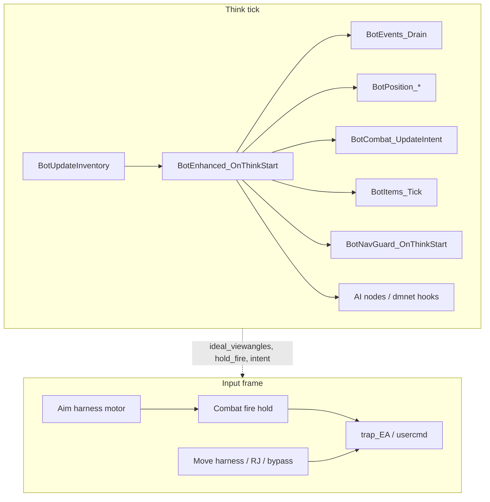

# Bot enhanced AI — overview

Devotion’s `bot_enhanced` path layers stronger aim, weapons, combat, items, movement, and 1v1 beliefs on top of vanilla botlib. When `bot_enhanced` is `0`, bots behave like stock Q3A.

Operator cvars and deprecated names: [BOT-CVARS.md](BOT-CVARS.md).

**North-facing include for legacy hooks:** `ai_bot_enhanced.h` — `BotEnhanced_IsActive`, register/reset, `OnThinkStart`, goal-stack helpers, and a few cross-module entry points (seek combat, observed pickups, etc.). Feature modules keep their own logic and usually gate with `BotEnhanced_IsActive()` (or a thin `BotXxx_IsActive()` that wraps it).

---

## Think vs input

Two layers, different cadences:

| Layer | When | Entry | Purpose |
|-------|------|--------|---------|
| **Think** | `bot_thinktime` (default 100 ms) | `BotDeathmatchAI` → `BotEnhanced_OnThinkStart` | Decisions: events, combat intent, items, position, opponent, nav guard, then AI nodes |
| **Input** | Every client frame | `BotUpdateInput` | Actuation: aim harness view motor, fire hold, movement bypass, usercmd |

```mermaid
flowchart TB
  subgraph think [Think tick]
    INV[BotUpdateInventory]
    ENH[BotEnhanced_OnThinkStart]
    DRAIN[BotEvents_Drain]
    POS[BotPosition_*]
    COMBAT[BotCombat_UpdateIntent]
    ITEMS[BotItems_Tick]
    NAV[BotNavGuard_OnThinkStart]
    NODE[AI nodes / dmnet hooks]
    INV --> ENH
    ENH --> DRAIN
    ENH --> POS
    ENH --> COMBAT
    ENH --> ITEMS
    ENH --> NAV
    ENH --> NODE
  end
  subgraph input [Input frame]
    AIM[Aim harness motor]
    MOVE[Move harness / RJ / bypass]
    FIRE[Combat fire hold]
    CMD[trap_EA / usercmd]
    AIM --> FIRE --> CMD
    MOVE --> CMD
  end
  think -.->|ideal_viewangles, hold_fire, intent| input
```

`BotEnhanced_AfterCheckSnapshot` runs after the snapshot pass (roam weapon tick, item timing, nav exile re-assert). Item pickups / respawns observed in the snapshot go through `BotEnhanced_OnObservedItemPickup` and related helpers — not the deferred events queue.

---

## Cvars

| Cvar | Role |
|------|------|
| `bot_enhanced` | Master gate (default `0`, archived). `1` enables the full enhanced bundle. |
| `bot_enhanced_debug` | Server logging for enhanced subsystems. Requires master on. |
| `bot_navstuck_debug` | High-rate nav stuck diagnostics after MoveToGoal. |
| `bot_debugAim` | Independent cheat aim debug overlay; works with or without enhanced. |

There are no live feature sub-cvars. Old names (`bot_humanizeaim`, `bot_enhanced_aim`, etc.) are read once at init for migration — see BOT-CVARS.md.

---

## Modules

| File | Role |
|------|------|
| `ai_bot_enhanced.c/h` | Master gate, think orchestration, elite skill getters, goal-stack guards, chat/camp/engage helpers |
| `ai_aim_harness.c/h` | Humanized view motor, tracking fire, rail/RL/SG urgency and lead |
| `ai_weapon_select.c/h` | Range/ammo weapon choice, roam bias, close-combat picks, hold-range preference |
| `ai_bot_tactics.c/h` | Gauntlet flee/rush, third-party hurt, threat swap, finish wounded; owns `BotEvents_*` impl |
| `ai_bot_events.h` | Deferred world→bot ingress API (`Push` / `Drain`); drain only from `OnThinkStart` |
| `ai_bot_combat.c/h` | Per-think intent (stance / move / fire), rush, peek aim, dodge bias (fire pressure + missiles blended into move), loadout tier, attack-move |
| `ai_bot_move_harness.c/h` | Aim-motor bypass for botlib movement, enhanced RJ, walk-off avoidance, travel flags |
| `ai_bot_move_util.h` | Shared geometry/view helpers (implemented in the move harness) |
| `ai_bot_items.c/h` | Visible pickup commits, empty weapon-pad camp, post-spawn arming (LG/RL then rail), stuck-abort / preserve-goal |
| `ai_bot_item_timing.h` (+ items) | Per-bot spawn timing beliefs (FFA / Duel / TDM when enhanced) |
| `ai_bot_position.c/h` | Height advantage, ledge hold/seek, item harass, elevated goal bias |
| `ai_bot_opponent.c/h` | 1v1 opponent location/stack beliefs, flee/duel commit, sensory/vigilance roam view (danger over look-along-travel) |
| `ai_bot_nav_guard.c/h` | Idle / short-loop breakout and route exile |
| `ai_bot_dmnet.c/h` | Thin seek/battle hooks called from legacy `ai_dmnet.c` |
| `ai_dmq3.c` / `ai_dmnet.c` / `ai_main.c` | Legacy AI; call into enhanced facade at boundaries |
| `ai_main.h` | Per-bot state blocks (`combat`, `evt_*`, `aimh_*`, `movej_*`, `wps_*`, `tact_*`, opponent, items, …) |

---

## Decision layers

| Mechanism | Timing | Use for |
|-----------|--------|---------|
| **Events queue** (`evt_*`) | Pushed any time; drained once per think | World → bot signals (e.g. hurt by third party) |
| **Combat intent** (`bs->combat`) | Updated each think in `BotCombat_UpdateIntent` | Stance, move/fire policy for this think |
| **Same-tick notify** | Immediate | `BotCombat_OnWeaponCommitted` from weapon select |
| **Snapshot observe** | During snapshot check | Item pickups / respawns → timing + opponent beliefs |

When adding behavior: prefer updating intent or a feature module over scattering new logic through `ai_dmq3.c`. Prefer `ai_bot_enhanced.h` at legacy call sites.
